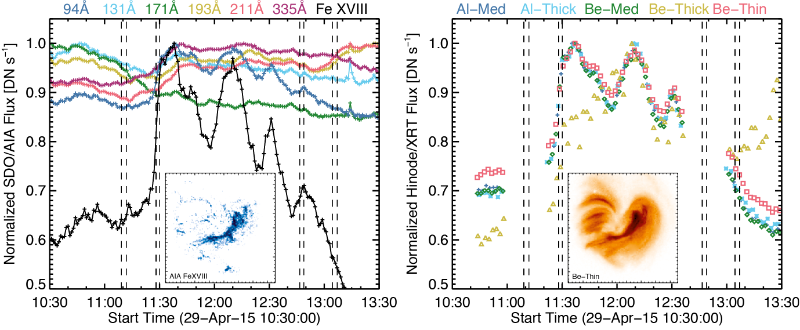
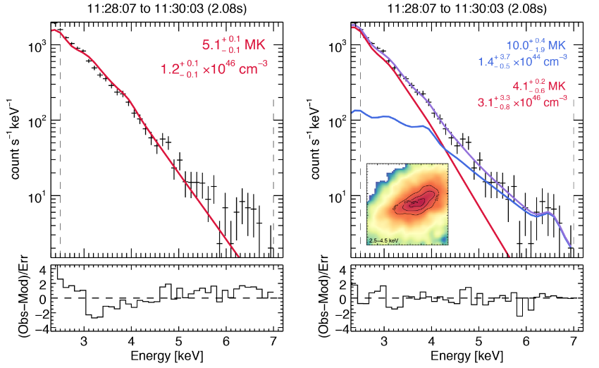
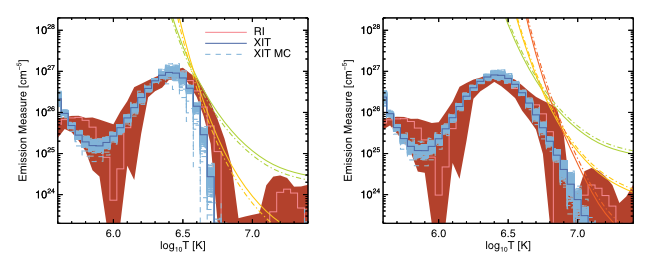
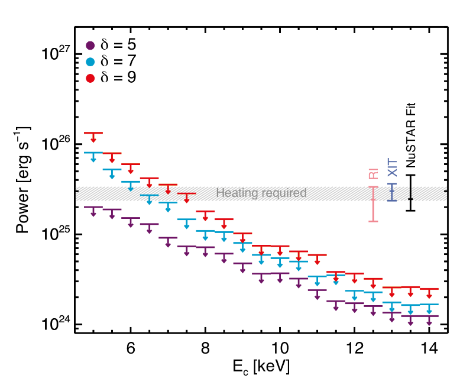

This article was originally publised as [UKSP Nugget (#84)](http://www.uksolphys.org/uksp-nugget/84-the-first-nustar-microflare/) in 2017, and is based upon this [AAS/SPD Poster](http://www.pauljwright.github.io/projects/2017_SPDPosterPrize)

**Introduction**
Solar flares are observed to occur over many orders of magnitude, with smaller flares occurring considerably more often than large flares. This relationship is observed to be a power-law over many orders of magnitude [1]; however, it is not clear how small flare-like events can be and whether they share the same physical properties of large flares, both heating material and accelerating particles.

With the launch of the Nuclear Spectroscopic Telescope Array (NuSTAR) [2], Hard X-Ray (HXR; 2.5 − 78 keV) observations of faint, previously undetectable solar sources can be obtained. NuSTAR consists of two direct focusing telescopes and has over 10x the effective area, and a much smaller background than RHESSI. As NuSTAR is an astrophysics mission solar observations lead to various challenges [3], but recent studies have demonstrated that NuSTAR is highly capable of observing weak X-ray sources from the Sun. These observations range from occulted post-flare loops [4], to microflaring, and non-flaring active regions (ARs) [5,6,7], and quiet sun observations [8].

In this nugget we present the first joint observations of a microflaring active region with Hinode/XRT, SDO/AIA and NuSTAR. This equivalent A0.1 GOES class microflare (determined during the impulsive phase) within AR12333 shows heating of material to several million Kelvin, observed in Soft X-rays (SXRs) with Hinode/XRT, and was faintly visible in Extreme-UltraViolet (EUV) with SDO/AIA.

 
<figure class="image">
  
  <figcaption><b>Figure 1:</b> <i>Time profiles of the SDO/AIA (left) and Hinode/XRT (right) channels from the microflaring loop of AR12333. The vertical bars indicate the four times corresponding to NuSTAR observations of the same region. Images of AR12333 are additionally shown (inset) during the impulsive phase (~11:29 UT), and display clear loop heating.</i></figcaption>
</figure>
 

**NuSTAR Imaging Spectroscopy**
On 29th April 2015 Hinode/XRT was near-continuously observing AR12333, in which a small A0.1 microflare occurred, producing hot loops visible in the Hinode/XRT channels, as well as the hottest SDO/AIA channel (particularly the hotter Fe XVIII component of 94Å), see Fig. 1. During this time NuSTAR was producing two full-disk mosaics (its 12’x12′ field of view requiring at least 16 separate pointings to capture the whole Sun) and subsequently observed AR12333 four times, catching the impulsive phase of the microflare (see Fig 1.). The NuSTAR image of the microflare (inset Fig 2.) shows similar loop emission that matches that shown in Hinode/XRT and SDO/AIA. Crucially NuSTAR is an imaging spectrometer and so X-ray spectra are obtained, and fitted, for this region for each of NuSTAR’s four observations. During the pre-flare, decay, and post-flare phases, the NuSTAR spectra are well fitted by a single thermal model of 3.2−3.5 MK, but the spectrum obtained during the impulsive phase shows emission inconsistent with a such a model. We instead performed a two-thermal fit to this spectrum, finding a hotter component of about 10MK, which fits the bump in emission between 6 and 7 keV due to line emission from the Fe K-Shell transition [9]. This thermal fit, and no counts observed > 7 keV, indicate that NuSTAR is only detecting thermal emission from this microflare.

 
<figure class="image">
  
  <figcaption><b>Figure 2:</b> <i>NuSTAR spectrum for the impulsive phase with a single thermal fit (left), and two-thermal fit (right). The NuSTAR 2.5-4.5 keV map with 50-70-90% contours (shown over the same field of view as those in Fig. 1) is inset. The quoted uncertainties are with 90% confidence, and no counts are observed > 7 keV.</i></figcaption>
</figure>
 

**Microflare Multi-thermal Emission**
With this microflare we can calculate the differential emission measure (DEM) distribution using SDO/AIA, Hinode/XRT, and NuSTAR, giving unprecedented coverage in temperature. By comparing the observed fluxes to those derived from the NuSTAR spectral fits, we find that the Hinode/XRT responses are about a factor of two too small, whereas the SDO/AIA Fe XVIII is as expected (see [5] for a complete discussion). Using these modified response functions we find the pre-flare DEM peaks at ~3 MK and falls off sharply by 5 MK; during the flare’s impulsive phase the emission above 3 MK is brighter and extends to 10 MK (Fig. 3). From these DEMs we determined the instantaneous heating rate during the impulsive phase of the microflare to be ~2.5 × 1025 erg s-1, consistent with the value obtained from the NuSTAR spectra [5].

 
<figure class="image">
  
  <figcaption><b>Figure 3:</b> <i>Emission measure distribution for the pre-flare (left) and impulsive (right) phase of the microflare using SDO/AIA, Hinode/XRT and NuSTAR data. The distributions were calculated using a regularized inversion method (RI, pink/maroon) as well as a spline forward fitting approach (XIT, blue/light blue). The NuSTAR EM loci curves (green, yellow, orange) were found for 2.5-4.0, 4.0-5.5 and 5.5-7.0 keV. The Hinode/XRT temperature responses used were multiplied by a factor of two.</i></figcaption>
</figure>
 

**Microflare Energetics**
The NuSTAR spectrum from the impulsive phase of this microflare is purely thermal (Fig. 2). The non-thermal emission from accelerated electrons is either not present or too weak for NuSTAR to observe in this microflare. With this observation NuSTAR did have a limited spectral dynamic range due to a short effective exposure (about 2s from a 116s pointing) from a low detector livetime, one of the challenges of solar observations [3]. We can therefore determine upper-limits on the possible non-thermal emission. The upper-limits were calculated using the thick-target model with a single negative power-law, with index δ, above a low-energy energy cut-off, Ec (see [10]). Each upper-limit was obtained by iteratively reducing the model electron flux, until the X-ray emission was consistent with a null detection with NuSTAR. Fig. 4 shows these upper-limits for a range of power-law indices along with the three estimates for the thermal power (calculated as the instantaneous thermal energy during the impulsive phase minus that of the pre-flare time) plotted with 1σ uncertainties. The grey shaded region represents the required heating power, consistent with all three estimates. We find that for the accelerated electrons to be the source of the heating requires a power-law spectrum of δ = 7 with Ec < 7 keV, and a steeper spectrum would have a larger Ec.

 
<figure class="image">
  
  <figcaption><b>Figure 4:</b> <i>Non-thermal power upper-limits as a function of low energy cutoff (Ec) plotted for different power-law indices (δ). The three estimates for the thermal power from DEM analysis (RI, XIT) and the NuSTAR Fit are plotted with 1σ uncertainties. The grey shaded region represents the required heating power, consistent with all three estimates.</i></figcaption>
</figure>
 

**Conclusions**
This A0.1 microflare observed with NuSTAR shows heating of material up to 10MK, as well as non-thermal upper limits consistent with accelerated electrons being the source of this heating, though requiring a steep power-law spectrum down to low energies. This first NuSTAR microflare therefore strongly resembles much more powerful flares in terms of energetics. Another NuSTAR observation [6], has also shown a slightly smaller microflare behaves like a scaled down larger event. Future observations with NuSTAR during quieter, more optimal times should help probe other microflares, potentially detecting their non-thermal emission. The NuSTAR observations have shown the huge potential for highly sensitive solar X-ray observations and hopefully this will lead to more observations from missions like [FOXSI](http://foxsi.umn.edu/), both in sounding rocket and possible satellite forms.

**References**

1. [Hannah et al. 2011 SSRv 159 263](https://doi.org/10.1007/s11214-010-9705-4)
2. [Harrison et al. 2013 ApJ 770 103](https://doi.org/10.1088/0004-637X/770/2/103)
3. [Grefenstette et al. 2016 ApJ 826 20](https://doi.org/10.3847/0004-637X/826/1/20)
4. [Kuhar et al. 2017 ApJ 835 6](http://dx.doi.org/10.3847/1538-4357/835/1/6)
5. [Wright et al. 2017 ApJ 844 132](https://doi.org/10.3847/1538-4357/aa7a59)
6. [Glesener et al. 2017 ApJ 845 122](https://doi.org/10.3847/1538-4357/aa80e9)
7. [Hannah et al. 2016 ApJL 820 L14](http://dx.doi.org/10.3847/2041-8205/820/1/L14)
8. [Marsh et al. 2017 ApJ 849 131](https://doi.org/10.3847/1538-4357/aa9122)
9. [Phillips 2004 ApJ 605 921]
10. [Holman et al. 2011 SSRv 159 107]

