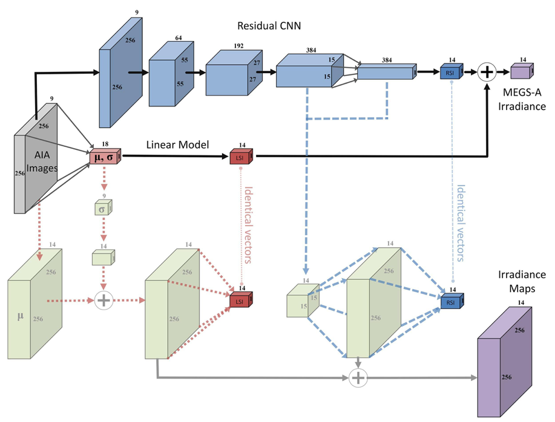

**This is slightly modified from the original press-release by the SETI Institute on October 2, 2019** ([see the press coverage here](https://www.seti.org/press-release/nasa-frontier-development-lab-uses-deep-learning-monitor-suns-ultraviolet-emission)).

*October 2, 2019, Mountain View, CA* -- A NASA Frontier Development Lab (FDL) team has shown that by using deep learning, it’s possible to virtually monitor the Sun’s extreme ultraviolet (EUV) irradiance, which is a driver of space weather. 
The Sun is vital for survival, but solar flares, which typically occur a few times a year, have the potential to cause severe disruptions in space and on Earth. 
These disruptions could impact spacecraft, satellites and even systems here on Earth, including GPS and radio communications. 
Deep learning can help get more value out of the current ability to monitor the Sun by providing virtual instruments to supplement physical devices. 
This research was recently published in Science Advances on October 2, 2019 (<a href="https://advances.sciencemag.org/content/5/10/eaaw6548">*A Deep Learning Virtual Instrument for Monitoring Extreme UV Solar Spectral Irradiance*</a>).

"Our research shows how a deep neural network can be trained to mimic an instrument on the Solar Dynamics Observatory (SDO),” said  FDL team member and co-author Alexander Szenicer (Oxford University). 
"By inferring what ultraviolet radiation levels that sensor would have detected based on what the other instruments on SDO are observing at any given time, we demonstrate it is possible to increase scientific productivity of NASA missions and to increase our capability to monitor solar sources of space weather.”

FDL is a partnership between NASA Ames Research Center, the SETI Institute and private sector and space agency partners including Google Cloud, Intel AI, IBM, Kx, Lockheed Martin, Luxembourg Space Agency, NVIDIA, Canadian Space Agency, HPE, and Element AI. 
During an 8-week summer research accelerator, interdisciplinary teams comprised of early-career researchers in AI and natural science domains work together to apply AI and machine learning to address important challenge questions. 
The challenge question that triggered this research was to develop an AI model using SDO images to predict solar spectral irradiance.

Traditionally, methods for monitoring solar EUV spectral irradiance include physics-inspired models that attempt to predict EUV emission.
These use either magnetic field distributions on the Sun's surface or physics-based inversions of the plasma distribution in the Sun's corona (see [DeepEM](2018_DeepEM)). **These new results show it is possible to use imaging observations of the Sun (256 x 256 x 9) to create a proxy measurement of EUV spectral irradiance (14 x 1). 
Feeding coronal images from NASA's SDO to a deep neural network allows us to generate proxy EUV measurements with an accuracy that surpasses physics-based models.**

Additionally, the team developed benchmarks and protocols for comparing model predictions between EUV models. 
These will be useful for future studies. 
Thus far, research has barely scratched the surface on what's feasible by combining deep learning with large-scale scientific space data. 
Data science and machine learning will play increasingly important roles in our endeavor to understand the origins of space weather and how to live with the Sun.

The lead authors on the paper are Szenicer and David Fouhey (University of Michigan). 
Co-authors and FDL team members are Richard Galvez (New York University), Rajat Thomas (University of Amsterdam) and Paul Wright (Stanford University). 
Co-authors and team mentors are Meng Jin (SETI Institute), Mark Cheung (Lockheed Martin Solar and Astrophysics Laboratory) and Andres Munoz-Jaramillo (Southwest Research Institute).

**Reference**: A. Szenicer, D. F. Fouhey, A. Munoz-Jaramillo, P. J. Wright, R. Thomas, R. Galvez, M. Jin,
M. C. M. Cheung, <a href="https://advances.sciencemag.org/content/5/10/eaaw6548">A deep learning virtual instrument for monitoring extreme UV solar spectral
irradiance</a>. Sci. Adv. 5, eaaw6548 (2019).
 
<figure class="image">
  
  <figcaption><b>Proposed Neural Network Architecture</b>. <i>After computing summary statistics of the input images and making a prediction via a linear model, a convolutional neural network makes a
prediction that corrects this linear model. The combined linear+CNN model is shown in bold colors
and arrows.    

The numbers attached to the boxes denote the sizes of the representations of the data as it goes
through the network, e.g. the first block annotated with 256, 256 and 9 represents an input of 256x256
pixels and 9 channels. We produce spatially resolved maps in units of irradiance to validate how the
CNN is operating by rearranging commutative operations in the last two layers of the
CNN (blue dashed path) and the linear model (red dashed path). These operations yield identical
outputs as the original (bold) model (illustrated with faint vertical lines), but recasting them this way
enable the diagnosis of the model’s operation. </i> </figcaption>
</figure>
 

----

**About the NASA Frontier Development Lab (FDL)** 
Hosted in Silicon Valley by the SETI Institute, NASA FDL is an applied artificial intelligence research accelerator developed in partnership with NASA's Ames Research Center.  Founded in 2016, the NASA FDL aims to use AI technologies to challenges in space exploration by pairing machine learning expertise with space science and exploration researchers from academia and industry. These interdisciplinary teams address tightly defined problems and the format encourages rapid iteration and prototyping to create outputs with meaningful application to the space program and humanity.

**About the SETI Institute** 
Founded in 1984, the SETI Institute is a non-profit, multi-disciplinary research and education organization whose mission is to explore, understand, and explain the origin and nature of life in the universe and the evolution of intelligence. Our research encompasses the physical and biological sciences and leverages expertise in data analytics, machine learning and advanced signal detection technologies. The SETI Institute is a distinguished research partner for industry, academia and government agencies, including NASA and NSF.

<!--**Contact information**

**James Parr
**
  
FDL Executive Producer
  

Frontier Development Lab
  

james@frontierdevelopmentlab.org
  
[
www.frontierdevelopmentlab.org
](https://
www.frontierdevelopmentlab.org
)

**Rebecca McDonald**
  

Director of Communications
  
SETI Institute

  
189 Bernardo Ave., Suite 200

  
Mountain View, CA 94043
  

rmcdonald@seti.org

  
[www.seti.org](https://www.seti.org)-->